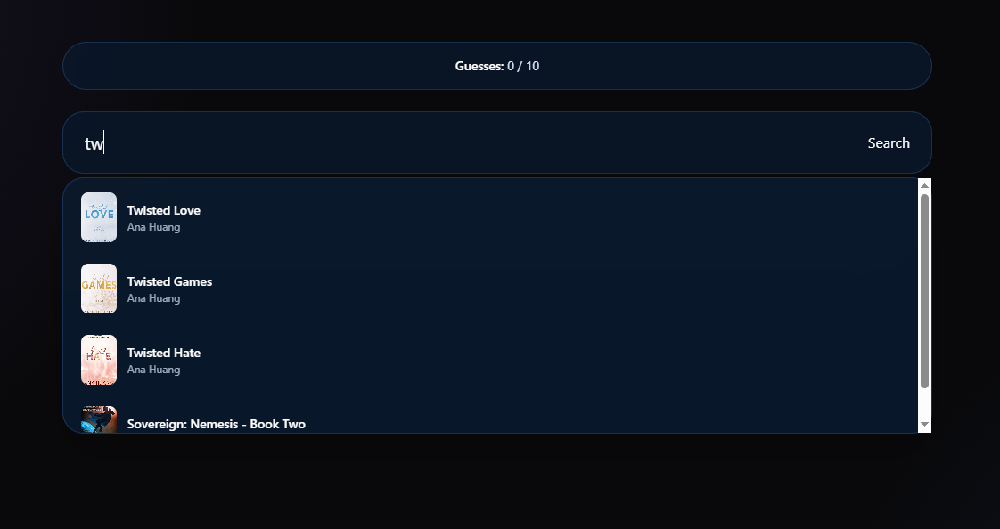

# 📚 Book Wordle

A Wordle-inspired guessing game for book lovers.

Try to identify the mystery book in a maximum of **10 guesses**. Each guess gives you feedback about the book's title, author, publication year and genre, helping you get closer to the correct answer.

## 🎮 How to Play

1. Search for a book using the search bar.
2. Select or submit your guess.
3. Compare your guess with the mystery book.
4. Use the feedback to narrow down your next guess.
5. You have a maximum of **10 attempts** to find the correct book.

### Feedback

Each guess provides information about:

- 📖 **Title** — whether the title is correct
- ✍️ **Author** — whether the author is correct
- 📅 **Publication Year** — whether the year matches, with an arrow indicating whether the guessed year is more recent or older
- 🏷️ **Genre** — which genres match the mystery book

## ✨ Features

- 🔎 Book search with autocomplete suggestions
- ⚡ Debounced search input
- 🎯 Random mystery book selection
- 🧩 Feedback after every guess
- 🔢 Maximum of 10 guesses
- 🚫 Prevents duplicate guesses
- 🎉 Win and game-over result modals
- 📱 Responsive interface
- 🌙 Dark, cinematic UI
- 📚 Local book dataset
- 🧪 Automated tests for the main game flows

## 🛠️ Tech Stack

- **React 19**
- **TypeScript**
- **Vite**
- **Tailwind CSS**
- **Vitest**
- **React Testing Library**
- **HTML5 / CSS3**

## 🏗️ Project Structure

```text
src/
├── components/
│   ├── guessCard.tsx
│   ├── guessInfoCard.tsx
│   ├── inputSearch.tsx
│   └── resultModal.tsx
│
├── data/
│   ├── books.json
│   └── books-v1.json
│
├── hooks/
│   └── useBooks.tsx
│
├── utils/
│   └── types.ts
│
├── App.tsx
├── App.css
├── App.test.tsx
├── index.css
└── main.tsx
```

## 🧠 Architecture

The application is built using a component-based React architecture.

### Custom Hook

The `useBooks` custom hook is responsible for loading the local book dataset and transforming the imported data into the `Book` type used throughout the application.

### Components

- **`GuessSearchInput`**  
  Handles book searching, autocomplete suggestions and debouncing.

- **`GuessCard`**  
  Displays the feedback generated for each guess.

- **`GuessInfoCard`**  
  Displays individual pieces of feedback such as author, year, title and genre.

- **`ResultModal`**  
  Displays the result when the player wins, loses or performs an invalid action.

## 🔍 Search

The search functionality provides autocomplete suggestions based on the user's input.

The input uses a **300ms debounce** to avoid continuously updating the search state while the user is typing.

Book suggestions display:

- Cover
- Title
- Author

## 📚 Book Data

The application currently uses a local JSON dataset containing book information such as:

- Title
- Author
- Publication year
- Genres
- Cover
- Popularity-related metadata

The current dataset was generated using data from **Open Library**.

The dataset focuses primarily on books published from **2014 onwards** and includes popular contemporary titles across genres such as:

- Romance
- Fantasy
- Thriller
- Mystery
- Science Fiction
- Young Adult
- Horror
- Adventure

## 🧪 Testing

The project uses **Vitest** and **React Testing Library**.

Current tests cover important game scenarios, including:

- Correct book guesses
- Invalid book searches
- Preventing duplicate guesses
- Displaying the appropriate result modal

Run the tests with:

```bash
npm test
```

## 🚀 Getting Started

### Prerequisites

Make sure you have Node.js installed.

### Installation

Clone the repository:

```bash
git clone https://github.com/jessica-alves-19/book-wordle-app.git
```

Navigate to the project:

```bash
cd book-wordle-app
```

Install dependencies:

```bash
npm install
```

Start the development server:

```bash
npm run dev
```

The application will then be available through the local Vite development server.

## 📦 Available Scripts

| Command | Description |
| --- | --- |
| `npm run dev` | Starts the development server |
| `npm run build` | Creates a production build |
| `npm run preview` | Previews the production build |
| `npm run lint` | Runs ESLint |
| `npm test` | Runs the test suite |

## 🔮 Future Improvements

Some ideas for future versions include:

- 📅 Daily challenges
- 💾 Persisting game progress with Local Storage
- 📊 Statistics and win rate
- 🔥 Streak system
- 📤 Shareable results
- 🎨 Improved animations and transitions
- 📚 Larger and more curated book dataset
- 🔐 User accounts and personal statistics
- 🌐 Live book data integration
- 📱 Improved mobile experience

## 📸 Screenshots

### 🏠 Home



### 🎮 Gameplay


### 🏆 Game Result


## 👩‍💻 Author

**Jéssica Alves**

Computer Engineering graduate and Software Engineer interested in frontend development, React and TypeScript.

[GitHub](https://github.com/jessica-alves-19)

## 📄 License

This project is for educational and portfolio purposes.
